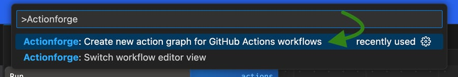
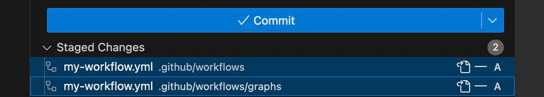
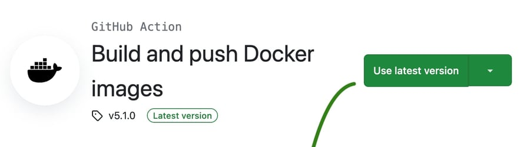
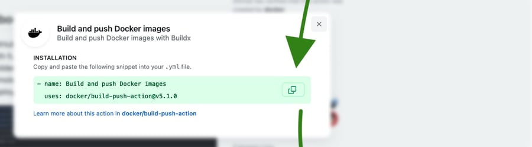
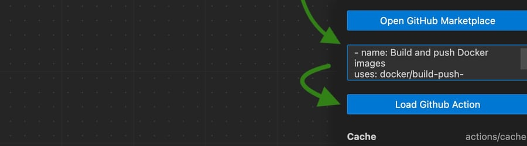

# Actionforge VS Code Extension
<!-- markdownlint-disable MD033 -->

Welcome to the source code of the Actionforge VS Code Extension

<div align="center" width="100%">
  <!-- No SVG due to VS Code Marketplace restrictions-->
  


[](https://www.typescriptlang.org/)
[](https://www.github.com/actionforge/legal/blob/main/LICENSE.md)

</div>

Actionforge supercharges your GitHub Actions workflow experience in VS Code. Designed for time saving, this extension integrates seamlessly into your coding environment, offering a suite of tools to help you manage your GitHub Actions workflows. Whether you're a beginner or a seasoned developer, Actionforge helps set up your workflows within minutes, not hours. You can finally say good bye to tedious editing of YAML files.

<div align="center" width="100%">
  
</div>

## Create your first workflow

The easiest way to create a workflow is to use the command called `Create a new action graph for GitHub Actions workflow`.

<div align="center" width="100%">
  
</div>

Select a name for your workflow and press `Enter`.

<div align="center" width="100%">
  
</div>

The extension will now create two files, a workflow file and an action graph file.

<div align="center" width="100%">
  
</div>

### Why two files?

In order to use an action graph in your workflow, Actionforge needs two files.

The first one is a traditional GitHub Action workflow with a **single** step that runs the `actionforge/action` action. Here is an example file of

#### my-workflow.yml

```yaml
on: [push]

jobs:
    build-and-publish:
      runs-on: ubuntu-latest
      name: My workflow
      steps:
        - name: Execute Action Graph
          uses: actionforge/action@v0.4.35
          with:
            graph_file: my-workflow.yml
```

The second one is the action graph itself. This is a YAML file that you can edit via the graph editor that is part of this extension.

## Add third-party GitHub Actions to your workflow

In order to add GitHub Actions to the node list, visit the [VS Code Marketplace](https://marketplace.visualstudio.com/items?itemName=actionforge.graph-runner).

### 1) Select a version

Select the version you want to use, usually the latest version. Click on the green button.

<div align="center" width="100%">
  
</div>

### 2) Copy

Coy the snippet below to the clipboard.

<div align="center" width="100%">
  
</div>

### 3) Paste

Paste the snippet into the text field of the graph editor and click on the `Load GitHub Action` button.

<div align="center" width="100%">
  
</div>

After the action has been loaded, you can create a new node.

## License

This SOFTWARE is licensed under the Actionforge Community License that you can find [here](https://github.com/actionforge/legal/blob/main/LICENSE.md).

Licenses for commercial use will soon be available on the GitHub Marketplace.

For further information [Get in touch](mailto:hello@actionforge.dev).
